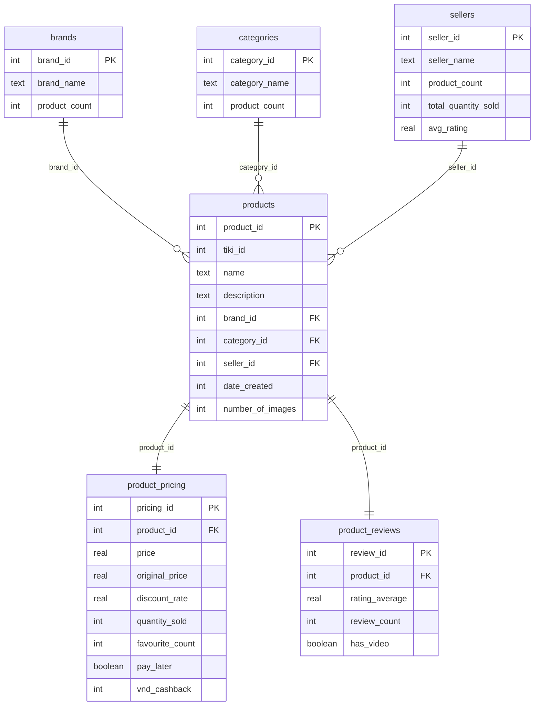

# Vietnamese Tiki Products Database Schema

<!-- Mermaid ERD Code (stored for reference, not displayed in frontend) -->

## Schema Image

The visual ERD diagram is now displayed as an image in the frontend at:
`/code/frontend/public/images/tiki_database_schema.png`

## Table Relationships

- **brands** → **products**: One brand can have many products
- **categories** → **products**: One category can have many products  
- **sellers** → **products**: One seller can have many products
- **products** → **product_pricing**: One-to-one relationship for pricing data
- **products** → **product_reviews**: One-to-one relationship for review data

## Key Features

- **Normalized Structure**: 6 tables with proper foreign key relationships
- **Complex JOIN Support**: Enables multi-table Vietnamese NL2SQL queries
- **Data Integrity**: Foreign key constraints ensure referential integrity
- **Performance Optimized**: Indexed foreign keys for fast JOIN operations
- **Vietnamese E-commerce**: Tailored for Tiki marketplace product data

## Record Counts

- **brands**: 824 unique brands
- **categories**: 155 product categories
- **sellers**: 3,807 marketplace sellers
- **products**: 41,576 core product records
- **product_pricing**: 83,206 pricing records
- **product_reviews**: 83,206 review records
