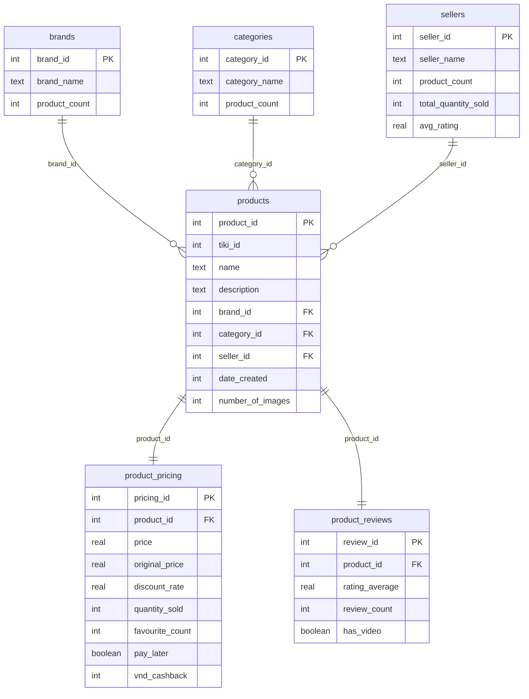

# Vietnamese Tiki Products Database Schema

<!-- Mermaid ERD Code (stored for reference, not displayed in frontend) -->

## Schema Image

The visual ERD diagram is now displayed as an image in the frontend at:
`/code/frontend/public/images/tiki_database_schema.png`

## Table Relationships

- **brands** → **products**: One brand can have many products
- **categories** → **products**: One category can have many products  
- **sellers** → **products**: One seller can have many products
- **products** → **product_pricing**: One-to-one relationship for pricing data
- **products** → **product_reviews**: One-to-one relationship for review data

## Key Features

- **Normalized Structure**: 6 tables with proper foreign key relationships
- **Complex JOIN Support**: Enables multi-table Vietnamese NL2SQL queries
- **Data Integrity**: Foreign key constraints ensure referential integrity
- **Performance Optimized**: Indexed foreign keys for fast JOIN operations
- **Vietnamese E-commerce**: Tailored for Tiki marketplace product data

## Data Tables

### Table 1: Brands Table

| Field Name | Data Type | Constraints | Description |
|------------|-----------|-------------|-------------|
| brand_id | INT | PRIMARY KEY | Unique brand identifier |
| brand_name | TEXT | NOT NULL | Brand name (Samsung, Apple, etc.) |
| product_count | INT | NOT NULL | Number of products for this brand |

### Table 2: Categories Table

| Field Name | Data Type | Constraints | Description |
|------------|-----------|-------------|-------------|
| category_id | INT | PRIMARY KEY | Unique category identifier |
| category_name | TEXT | NOT NULL | Product category name (Vietnamese) |
| product_count | INT | NOT NULL | Number of products in this category |

### Table 3: Sellers Table

| Field Name | Data Type | Constraints | Description |
|------------|-----------|-------------|-------------|
| seller_id | INT | PRIMARY KEY | Unique seller identifier |
| seller_name | TEXT | NOT NULL | Marketplace seller name |
| product_count | INT | NOT NULL | Number of products sold by seller |
| total_quantity_sold | INT | NOT NULL | Total quantity of all products sold |
| avg_rating | REAL | NULL | Average seller rating |

### Table 4: Products Table (Primary table)

| Field Name | Data Type | Constraints | Description |
|------------|-----------|-------------|-------------|
| product_id | INT | PRIMARY KEY | Unique product identifier |
| tiki_id | INT | NOT NULL | Original Tiki marketplace ID |
| name | TEXT | NOT NULL | Product name (Vietnamese) |
| description | TEXT | NULL | Detailed product description |
| brand_id | INT | FOREIGN KEY | Reference to brands table |
| category_id | INT | FOREIGN KEY | Reference to categories table |
| seller_id | INT | FOREIGN KEY | Reference to sellers table |
| date_created | INT | NOT NULL | Product creation timestamp |
| number_of_images | INT | NOT NULL | Count of product images |

### Table 5: Product Pricing Table

| Field Name | Data Type | Constraints | Description |
|------------|-----------|-------------|-------------|
| pricing_id | INT | PRIMARY KEY | Unique pricing record identifier |
| product_id | INT | FOREIGN KEY | Reference to products table |
| price | REAL | NOT NULL | Current selling price in VND |
| original_price | REAL | NOT NULL | Original price in VND |
| discount_rate | REAL | NULL | Discount percentage |
| quantity_sold | INT | NOT NULL | Number of units sold |
| favourite_count | INT | NOT NULL | Number of users who favorited |
| pay_later | BOOLEAN | NOT NULL | Pay later option available |
| vnd_cashback | INT | NULL | Cashback amount in VND |

### Table 6: Product Reviews Table

| Field Name | Data Type | Constraints | Description |
|------------|-----------|-------------|-------------|
| review_id | INT | PRIMARY KEY | Unique review record identifier |
| product_id | INT | FOREIGN KEY | Reference to products table |
| rating_average | REAL | NOT NULL | Average product rating |
| review_count | INT | NOT NULL | Total number of reviews |
| has_video | BOOLEAN | NOT NULL | Product has video reviews |

## Record Counts

- **brands**: 824 unique brands
- **categories**: 155 product categories
- **sellers**: 3,807 marketplace sellers
- **products**: 41,576 core product records
- **product_pricing**: 83,206 pricing records
- **product_reviews**: 83,206 review records
