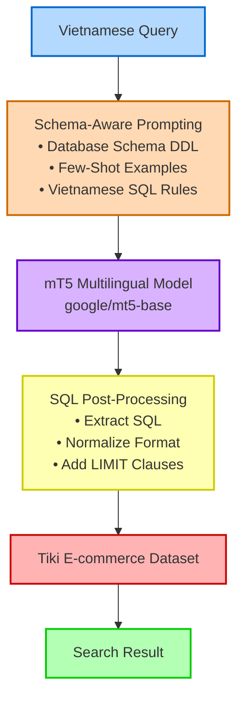
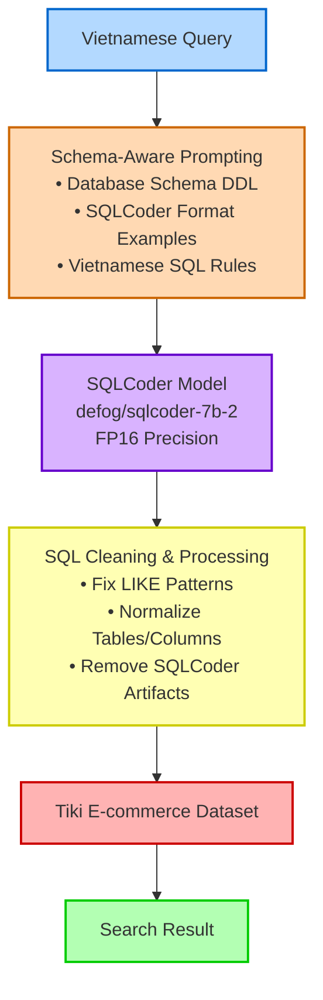
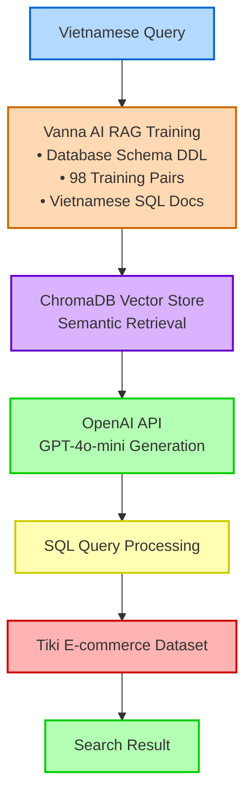

# Vietnamese NL2SQL Pipeline Architecture Diagrams

## Pipeline 1: mT5 Zero-Shot Prompting

## Pipeline 2: SQLCoder Zero-Shot

## Pipeline 3: Vanna AI RAG (Reference)

## Key Differences Summary

| Component | P1 mT5 | P2 SQLCoder | P3 Vanna AI |
|-----------|--------|-------------|-------------|
| **Model** | google/mt5-base (580M params) | defog/sqlcoder-7b-2 (7B params) | OpenAI GPT-4o-mini |
| **Approach** | Direct prompting | Direct prompting | RAG retrieval + generation |
| **Context** | Static few-shot examples | Static few-shot examples | Dynamic ChromaDB retrieval |
| **Latency** | 0.30s | 1.76s | ~0.50s |
| **GPU Memory** | 2.5 GB | 13.8 GB | API-based (no local GPU) |
| **EM Performance** | 16% | 18% | ~27% (with fixes) |
| **EX Performance** | 33% | 22% | ~57% (with fixes) |
| **Processing** | Minimal post-processing | Heavy SQL cleaning | Rule-based fallbacks |

## Architecture Patterns

### P1 & P2 (Zero-Shot Prompting)
- **Single-stage generation**: Query → Prompt → Model → SQL
- **Static context**: Same examples for all queries
- **Local inference**: GPU-based generation
- **Trade-off**: Speed vs accuracy (mT5 faster, SQLCoder more accurate)

### P3 (RAG-based)
- **Two-stage generation**: Query → Retrieval → Context + Generation → SQL
- **Dynamic context**: Retrieved similar examples per query
- **Hybrid approach**: Vector store + OpenAI API
- **Trade-off**: Better context awareness but API dependency
