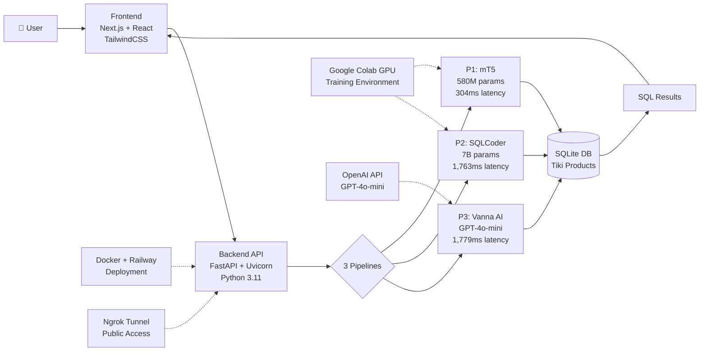
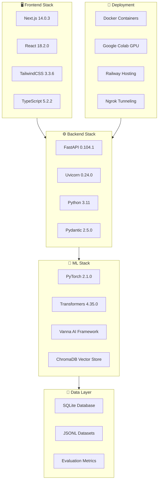

# Vietnamese NL2SQL System - Tech Stack Architecture

## Simplified System Architecture



## Core Technology Stack



---

## **Architecture Layer Explanations**

### **1️⃣ Client Layer**
**Purpose:** User interaction and presentation

- **User Interface (Next.js + React)**
  - Provides responsive web application for Vietnamese query input
  - Real-time display of generated SQL queries and execution results
  - Interactive dashboard showing performance metrics (EM, EX, latency)
  - Multi-pipeline comparison view for analyzing different approaches

- **Web Application (TailwindCSS + TypeScript)**
  - Type-safe frontend with modern UI components
  - Utility-first styling for consistent design system
  - Client-side routing and state management
  - Visualization of query complexity breakdown and error analysis

**Key Technologies:** Next.js 14, React 18, TailwindCSS, TypeScript

---

### **2️⃣ Application Layer**
**Purpose:** API orchestration and request routing

- **Backend API (FastAPI + Python)**
  - RESTful API endpoints for 3 independent pipelines (P1, P2, P3)
  - Asynchronous request handling for concurrent query processing
  - Health monitoring and status reporting for each pipeline
  - CORS middleware for secure cross-origin communication

- **Service Configuration (Pydantic)**
  - Request/response validation and type checking
  - Environment variable management for API keys and secrets
  - Configuration profiles for development/production environments
  - Error handling and logging middleware

**Key Technologies:** FastAPI 0.104, Uvicorn, Python 3.11, Pydantic

---

### **3️⃣ Data Layer**
**Purpose:** Data storage and management

- **Data Logic**
  - SQL query validation and sanitization
  - Database connection pooling and optimization
  - Result set formatting and serialization
  - Evaluation dataset loading and caching

- **Product Database (SQLite + Tiki E-commerce)**
  - Normalized schema with 10K+ Vietnamese product records
  - Tables: products, brands, categories, pricing, reviews
  - Optimized indexes for fast query execution
  - Support for complex JOINs and aggregations

- **Training/Evaluation Datasets (JSONL)**
  - 300-query evaluation set with complexity labels (simple/medium/complex)
  - Training examples for Vanna AI RAG system
  - Gold-standard SQL queries for metric calculation
  - Stratified sampling ensuring balanced complexity distribution

**Key Technologies:** SQLite, Pandas, NumPy, JSONL format

---

### **4️⃣ LLM Model Processing Layer**
**Purpose:** Vietnamese NL2SQL translation using AI models

- **Vietnamese Query Processing**
  - Input normalization (number conversion, diacritics handling)
  - E-commerce vocabulary recognition (brands, categories, price terms)
  - Intent classification (search, count, filter, aggregate)
  - Query complexity detection

- **Vanna AI RAG Training**
  - Database schema documentation in ChromaDB vector store
  - Vietnamese training examples (Q&A pairs) for retrieval
  - Multilingual embeddings for semantic similarity search
  - Dynamic context retrieval based on query similarity

- **Prompt Composition with Schema Awareness**
  - Schema serialization for model context
  - Few-shot example selection from training data
  - Template-based prompt engineering for consistent SQL structure
  - Constrained decoding to ensure valid SQL syntax

- **OpenAI ChatGPT-4o Model (P3 only)**
  - GPT-4o-mini for SQL generation with retrieved context
  - Temperature and top-p tuning for deterministic outputs
  - Token-efficient prompt optimization
  - Fallback mechanisms for API failures

- **Evaluation SQL with Database**
  - Execute generated SQL against Tiki database
  - Compare results with gold-standard queries
  - Exact Match (EM) and Execution Accuracy (EX) calculation
  - Error typology classification (schema/operator/linguistic)

- **Performance Metrics**
  - Latency tracking (3-run averaging for accuracy)
  - GPU memory usage monitoring (peak and average)
  - Success rate by query complexity
  - Detailed error logs for debugging

**Key Technologies:** PyTorch, Transformers, Vanna AI, ChromaDB, OpenAI API, Google Colab GPU

---

### **5️⃣ External Services**
**Purpose:** Third-party integrations and infrastructure

- **Secure Tunnel Service (Ngrok)**
  - Exposes Colab-hosted models via public HTTPS URLs
  - Custom domain for stable API endpoints
  - SSL/TLS encryption for secure data transmission
  - Tunneling allows local frontend to access cloud-hosted models

- **Model Repository (Hugging Face)**
  - Pre-trained model downloads (mT5, SQLCoder)
  - Version control for model checkpoints
  - Community models for Vietnamese NLP tasks
  - Tokenizer and configuration files hosting

- **Additional External Services**
  - **Google Colab:** GPU-accelerated training environment (T4/L4/A100)
  - **Google Drive:** Model artifact storage and synchronization
  - **OpenAI API:** GPT-4o-mini access for P3 Vanna AI pipeline
  - **Docker/Railway:** Containerization and cloud deployment

**Key Technologies:** Ngrok, Hugging Face Hub, Google Colab, Docker, Railway

---

## **Data Flow Through Layers**

1. **User Input** → Client Layer: Vietnamese query entered in web UI
2. **API Request** → Application Layer: FastAPI routes query to selected pipeline (P1/P2/P3)
3. **Data Retrieval** → Data Layer: Load schema and training examples from database
4. **SQL Generation** → LLM Processing Layer: AI model translates Vietnamese to SQL
5. **Validation** → Data Layer: Execute SQL and compare with expected results
6. **Metrics Calculation** → LLM Processing Layer: Compute EM, EX, latency
7. **Response** → Application Layer: Format results as JSON
8. **Display** → Client Layer: Visualize SQL, results, and metrics in UI

---

## **Technology Stack Breakdown**

### **1. Frontend Stack**
| Technology | Version | Purpose |
|------------|---------|---------|
| **Next.js** | 14.0.3 | React framework with SSR |
| **React** | 18.2.0 | UI component library |
| **TypeScript** | 5.2.2 | Type-safe JavaScript |
| **TailwindCSS** | 3.3.6 | Utility-first CSS framework |
| **Lucide React** | 0.294.0 | Modern icon library |
| **Recharts** | 2.8.0 | Data visualization charts |
| **Axios** | 1.6.2 | HTTP client for API calls |
| **Mermaid** | 11.11.0 | Diagram rendering |

### **2. Backend Stack**
| Technology | Version | Purpose |
|------------|---------|---------|
| **Python** | 3.11 | Core programming language |
| **FastAPI** | 0.104.1 | High-performance async API framework |
| **Uvicorn** | 0.24.0 | ASGI server |
| **Pydantic** | 2.5.0 | Data validation |
| **Python-dotenv** | 1.0.0 | Environment variable management |
| **Aiofiles** | 23.2.1 | Async file operations |
| **HTTPX** | 0.25.0 | Async HTTP client |

### **3. Machine Learning Stack**
| Technology | Version | Purpose |
|------------|---------|---------|
| **PyTorch** | 2.1.0 | Deep learning framework |
| **Transformers** | 4.35.0 | HuggingFace model library |
| **SentencePiece** | 0.1.99 | Tokenization |
| **BitsAndBytes** | 0.41.0+ | 8-bit quantization |
| **Sentence Transformers** | 2.0.0+ | Embeddings for Vanna AI |

### **4. Database & Data**
| Technology | Purpose |
|------------|---------|
| **SQLite** | Normalized Tiki e-commerce database |
| **Pandas** | Data manipulation |
| **NumPy** | Numerical operations |
| **JSONL Files** | Training/evaluation datasets |

### **5. AI Models**
| Pipeline | Model | Parameters | Quantization |
|----------|-------|------------|--------------|
| **P1** | google/mt5-base | ~580M | FP16 |
| **P2** | defog/sqlcoder-7b-2 | 7B | 8-bit |
| **P3** | OpenAI GPT-4o-mini | N/A | API |

### **6. Vector Database & RAG (P3 Only)**
| Technology | Purpose |
|------------|---------|
| **ChromaDB** | Vector store for RAG retrieval |
| **Vanna AI** | RAG framework for NL2SQL |
| **OpenAI Embeddings** | Text embeddings |
| **Multilingual Embeddings** | Vietnamese language support |

### **7. Training Environment**
| Technology | Purpose |
|------------|---------|
| **Google Colab** | Cloud GPU training platform |
| **NVIDIA GPUs** | A100 / L4 / T4 / V100 |
| **Google Drive** | Model artifact storage |
| **Mixed Precision** | BF16 / FP16 training |
| **Gradient Checkpointing** | Memory optimization |

### **8. Infrastructure & Deployment**
| Technology | Purpose |
|------------|---------|
| **Docker** | Application containerization |
| **Docker Compose** | Multi-container orchestration |
| **Railway** | Cloud deployment platform |
| **Ngrok** | Secure tunneling for Colab APIs |

### **9. External Services**
| Service | Purpose |
|---------|---------|
| **Hugging Face** | Model repository and hosting |
| **OpenAI API** | GPT-4o-mini for P3 Vanna AI |
| **Ngrok** | Public URL exposure for Colab |

### **10. Development Tools**
| Tool | Purpose |
|------|---------|
| **Git** | Version control |
| **GitHub** | Code repository |
| **Colab Secrets** | Secure API key management |
| **Python-dotenv** | Local environment variables |

---

## **Key Architectural Decisions**

### ✅ **Multi-Pipeline Architecture**
- **3 independent pipelines** for comparison
- **Shared evaluation framework** for fair metrics
- **Unified API interface** for frontend integration

### ✅ **Hybrid Deployment Strategy**
- **Training**: Google Colab GPU environment
- **Inference**: Local/Docker/Railway deployment
- **API**: FastAPI with async support

### ✅ **Data Flow**
1. **Frontend** (Next.js) sends Vietnamese query to API
2. **Backend** (FastAPI) routes to appropriate pipeline
3. **Pipeline** generates SQL using LLM
4. **Evaluator** validates SQL against database
5. **Metrics** returned to frontend for visualization

### ✅ **Security Implementation**
- **API Keys**: Colab Secrets + Environment Variables
- **No Hardcoded Keys**: All secrets externalized
- **Docker Secrets**: Secure container configuration

---

## **Performance Characteristics**

| Layer | Technology | Latency Impact |
|-------|------------|----------------|
| **Frontend** | Next.js SSR | ~50-100ms |
| **API** | FastAPI Async | ~10-20ms |
| **P1 (mT5)** | GPU Inference | ~300ms |
| **P2 (SQLCoder)** | 8-bit GPU | ~1,760ms |
| **P3 (Vanna)** | OpenAI API | ~1,780ms |
| **Database** | SQLite Query | ~5-10ms |

---

## **Resource Requirements**

### **Development Environment**
- **CPU**: Multi-core for backend
- **RAM**: 8GB minimum, 16GB recommended
- **Storage**: 10GB for models and data

### **Production Environment (Colab)**
- **GPU**: NVIDIA T4/L4/A100 (12-40GB VRAM)
- **RAM**: 12-25GB system memory
- **Storage**: 20GB for models + datasets

### **Docker Container**
- **Image Size**: ~5GB (with models)
- **Runtime Memory**: 4-8GB
- **CPU**: 2+ cores recommended

---

## **Development Workflow**

```
1. Local Development → FastAPI Backend + Next.js Frontend
2. Model Training → Google Colab GPU Environment
3. Model Export → Google Drive → Local Artifacts
4. Testing → Local Evaluation Scripts
5. Deployment → Docker → Railway
6. Monitoring → Metrics Dashboard + Logs
```

---

**Diagram File**: `/Users/thoduong/CascadeProjects/MSE_Thesis_2025/diagrams/tech_stack_architecture.md`
