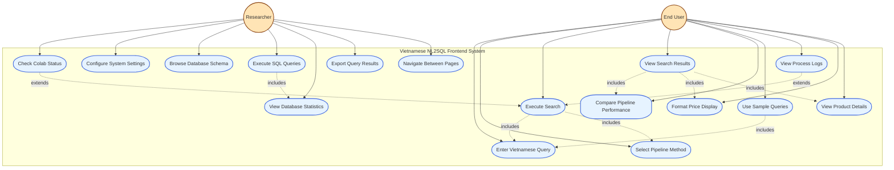

# Frontend Use Case Diagram - Vietnamese NL2SQL System

Standard UML use case diagram focusing on frontend user interactions:

## Use Case Descriptions

### Primary Actors
- **End User**: Vietnamese-speaking customers searching for products
- **Researcher**: MSE thesis researcher analyzing system performance

### Core Use Cases

#### Search Functionality
- **Enter Vietnamese Query**: Input natural language queries in Vietnamese text
- **Select Pipeline Method**: Choose between Pipeline 1, Pipeline 2, or both
- **Execute Search**: Submit query for processing through selected pipeline(s)
- **View Search Results**: Display product results with execution metrics
- **Use Sample Queries**: Click predefined queries (Simple/Medium/Complex)

#### Results & Analysis
- **Compare Pipeline Performance**: Side-by-side comparison of pipeline results
- **View Process Logs**: Real-time processing logs with timestamps
- **Format Price Display**: Vietnamese currency formatting (VND)
- **View Product Details**: Product name, description, brand, ratings

#### System Management
- **Check Colab Status**: Monitor Google Colab API connectivity
- **Configure System Settings**: Set Colab URLs and system parameters
- **Browse Database Schema**: Explore Tiki database structure
- **Execute SQL Queries**: Direct SQL execution for database analysis
- **View Database Statistics**: Database metrics and table information
- **Export Query Results**: Download results in CSV/JSON format
- **Navigate Between Pages**: Move between Search, Database, and Config pages

## Detailed Use Case Explanation

### System Overview
The Vietnamese NL2SQL Frontend System serves as the primary interface for users to interact with a sophisticated natural language processing system that converts Vietnamese queries into SQL commands. The system is designed to support both end-users seeking product information and researchers analyzing the performance of different translation pipelines.

### Actor Analysis

#### End User
The End User represents Vietnamese-speaking customers who want to search for products using natural language. These users may not have technical knowledge of SQL or database structures, so the system provides an intuitive interface where they can express their needs in everyday Vietnamese. For example, a user might type "tìm áo thun nam giá rẻ" (find cheap men's t-shirts) without needing to understand the underlying database schema or SQL syntax.

#### Researcher
The Researcher actor represents the MSE thesis developer and other technical users who need to analyze system performance, configure settings, and extract experimental data. This actor has deeper technical requirements, including the ability to monitor pipeline performance, configure external API connections, and export data for further analysis.

### Core Use Case Workflows

#### Primary Search Workflow
The main user journey begins with **Enter Vietnamese Query** (UC1), where users input their search terms in natural Vietnamese language. The system supports complex linguistic patterns including diacritics, compound words, and colloquial expressions common in Vietnamese e-commerce contexts.

Users then proceed to **Select Pipeline Method** (UC2), choosing between Pipeline 1 (direct Vietnamese-to-SQL), Pipeline 2 (Vietnamese-to-English-to-SQL), or both for comparison purposes. This selection allows users to experiment with different approaches and researchers to gather comparative performance data.

The **Execute Search** (UC3) use case orchestrates the entire processing workflow, sending the Vietnamese query through the selected pipeline(s) and coordinating with the backend API. This use case includes the query preprocessing, API communication, and result coordination.

#### Results and Analysis
**View Search Results** (UC4) presents the processed results in a user-friendly format, displaying product information including names, descriptions, prices in Vietnamese dong, ratings, and review counts. The interface handles both successful results and error states gracefully.

**Compare Pipeline Performance** (UC5) provides side-by-side analysis when both pipelines are selected, showing execution times, success rates, and result quality differences. This feature is particularly valuable for research purposes and system optimization.

#### System Monitoring and Configuration
**Check Colab Status** (UC8) monitors the connectivity to Google Colab APIs, which host the machine learning models. The system displays real-time status indicators and provides fallback notifications when external services are unavailable.

**Configure System Settings** (UC9) allows researchers to modify system parameters, including Colab API endpoints, timeout settings, and experimental configurations. This administrative functionality ensures the system can be adapted for different research scenarios.

#### Database Management Features
**Browse Database Schema** (UC10) provides insight into the underlying Tiki product database structure, helping researchers understand the data model and optimize their queries. **Execute SQL Queries** (UC11) allows direct database interaction for advanced analysis and debugging purposes.

**View Database Statistics** (UC12) presents comprehensive metrics about the database contents, including record counts, data distribution, and performance indicators. This information supports both system optimization and research analysis.

### User Experience Design

#### Accessibility and Localization
The system is specifically designed for Vietnamese users, with proper handling of Vietnamese diacritics, cultural context in product descriptions, and appropriate currency formatting (VND). The interface supports both technical and non-technical users through progressive disclosure of complexity.

#### Real-time Feedback
**View Process Logs** (UC7) provides transparent insight into the system's processing steps, showing users exactly what happens during query translation and execution. This feature builds user confidence and helps researchers debug issues.

#### Sample Query Integration
**Use Sample Queries** (UC6) offers pre-built examples categorized by complexity (Simple, Medium, Complex), helping users understand the system's capabilities and providing researchers with standardized test cases for performance evaluation.

### Technical Architecture Integration

The frontend use cases integrate seamlessly with the backend Vietnamese NL2SQL processing system, handling asynchronous API calls, error states, and performance monitoring. The system supports both local processing fallbacks and cloud-based machine learning inference through Google Colab integration.

The **Export Query Results** (UC13) functionality enables researchers to extract experimental data in standard formats (CSV, JSON) for further analysis, supporting the academic research objectives of the MSE thesis project.

### Frontend Architecture Features

#### React.js Components
- **Search Interface**: Vietnamese query input with pipeline selection
- **Results Display**: Dual-panel comparison view for both pipelines
- **Process Monitor**: Real-time log display with color-coded messages
- **Status Widgets**: Colab connectivity indicators
- **Sample Query Grid**: Categorized example queries by complexity

#### User Experience
- **Responsive Design**: Mobile-friendly interface with grid layouts
- **Real-time Feedback**: Loading states and progress indicators
- **Error Handling**: User-friendly error messages and fallback options
- **Vietnamese Localization**: Proper handling of Vietnamese diacritics and formatting
