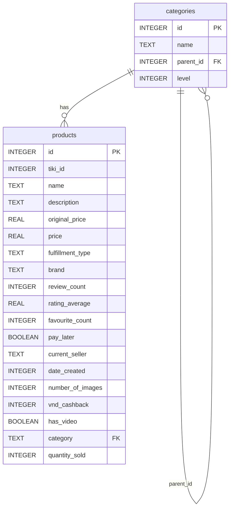

# Tiki Products Database Schema Analysis

## Database Overview
- **Database Type**: SQLite
- **Location**: `/code/backend/data/tiki_products.db`
- **Total Records**: 41,603 products, 16 categories

## Tables Structure

### Products Table
- **Records**: 41,603 products
- **Primary Key**: `id` (INTEGER, auto-increment)
- **Foreign Keys**: None (category stored as TEXT, not normalized)

### Categories Table  
- **Records**: 16 categories
- **Primary Key**: `id` (INTEGER, auto-increment)
- **Self-referencing**: `parent_id` references `categories.id` for hierarchical structure

## Mermaid Entity Relationship Diagram

## Database Indexes

The following indexes are created for query optimization:

- `idx_products_name` on `products(name)`
- `idx_products_price` on `products(price)`
- `idx_products_category` on `products(category)`
- `idx_products_brand` on `products(brand)`
- `idx_products_rating` on `products(rating_average)`

## Key Observations

1. **Denormalized Design**: The `products.category` field stores category names as TEXT rather than foreign key references to the `categories` table.

2. **Hierarchical Categories**: The `categories` table supports a hierarchical structure with `parent_id` self-referencing for category trees.

3. **Vietnamese E-commerce Data**: Contains Vietnamese product names and categories from Tiki marketplace.

4. **Product Categories**: Includes fashion items like bags (balo), shoes (giày), accessories, etc.

5. **Rich Product Metadata**: Comprehensive product information including pricing, ratings, reviews, seller info, and multimedia indicators.

## Sample Data Categories

**Main Categories (Level 1):**
- Điện thoại & Phụ kiện (Phones & Accessories)
- Laptop & Máy tính (Laptops & Computers)  
- Thời trang (Fashion)
- Điện tử & Điện lạnh (Electronics & Appliances)

**Product Categories in Data:**
- Balo nam/nữ (Men's/Women's backpacks)
- Giày dép (Shoes & Sandals)
- Phụ kiện thời trang (Fashion accessories)
- Túi xách (Handbags)
