# Vietnamese NL2SQL System - Use Case Diagram

Based on the codebase analysis, here's the use case diagram for the Vietnamese Natural Language to SQL system:

```mermaid
graph TB
    %% Actors
    User[👤 End User]
    Researcher[👨‍🔬 Researcher/Developer]
    ColabAPI[☁️ Google Colab API]
    Database[🗄️ Tiki Database]
    
    %% System Boundary
    subgraph "Vietnamese NL2SQL System"
        %% Primary Use Cases
        UC1[Submit Vietnamese Query]
        UC2[Select Pipeline Method]
        UC3[View Search Results]
        UC4[Compare Pipeline Performance]
        UC5[Export Results Data]
        
        %% Pipeline Use Cases
        UC6[Execute Pipeline 1<br/>Vietnamese → SQL]
        UC7[Execute Pipeline 2<br/>Vietnamese → English → SQL]
        
        %% System Management Use Cases
        UC8[Configure Colab Connection]
        UC9[Monitor System Status]
        UC10[View Database Schema]
        UC11[Analyze Performance Metrics]
        UC12[Export Experiment Data]
        
        %% Database Operations
        UC13[Query Product Database]
        UC14[Execute SQL Commands]
        UC15[Retrieve Product Information]
        
        %% Model Processing
        UC16[Process Vietnamese Text]
        UC17[Translate to English]
        UC18[Generate SQL Query]
        UC19[Validate SQL Syntax]
    end
    
    %% User Relationships
    User --> UC1
    User --> UC2
    User --> UC3
    User --> UC4
    
    %% Researcher Relationships
    Researcher --> UC5
    Researcher --> UC8
    Researcher --> UC9
    Researcher --> UC10
    Researcher --> UC11
    Researcher --> UC12
    
    %% System Internal Relationships
    UC1 --> UC6
    UC1 --> UC7
    UC2 --> UC6
    UC2 --> UC7
    
    UC6 --> UC16
    UC6 --> UC18
    UC6 --> UC13
    
    UC7 --> UC16
    UC7 --> UC17
    UC7 --> UC18
    UC7 --> UC13
    
    UC13 --> UC14
    UC14 --> UC15
    UC18 --> UC19
    
    %% External System Relationships
    UC16 -.-> ColabAPI
    UC17 -.-> ColabAPI
    UC18 -.-> ColabAPI
    UC13 --> Database
    UC14 --> Database
    UC15 --> Database
    
    %% Include Relationships
    UC3 --> UC15
    UC4 --> UC11
    UC5 --> UC12
    
    %% Styling
    classDef actor fill:#e1f5fe,stroke:#01579b,stroke-width:2px
    classDef usecase fill:#f3e5f5,stroke:#4a148c,stroke-width:2px
    classDef system fill:#e8f5e8,stroke:#1b5e20,stroke-width:2px
    classDef external fill:#fff3e0,stroke:#e65100,stroke-width:2px
    
    class User,Researcher actor
    class UC1,UC2,UC3,UC4,UC5,UC6,UC7,UC8,UC9,UC10,UC11,UC12,UC13,UC14,UC15,UC16,UC17,UC18,UC19 usecase
    class Database,ColabAPI external
```

## Use Case Descriptions

### Primary Actors

1. **End User**: E-commerce customers searching for products using Vietnamese natural language
2. **Researcher/Developer**: MSE thesis researcher analyzing and comparing pipeline performance
3. **Google Colab API**: External cloud service providing ML model inference
4. **Tiki Database**: SQLite database containing Vietnamese product information

### Core Use Cases

#### User-Facing Features
- **Submit Vietnamese Query**: Input natural language search queries in Vietnamese
- **Select Pipeline Method**: Choose between Pipeline 1, Pipeline 2, or both for comparison
- **View Search Results**: Display product results with execution details
- **Compare Pipeline Performance**: Side-by-side comparison of both pipeline results

#### Research & Analysis Features
- **Configure Colab Connection**: Set up and manage Google Colab API endpoints
- **Monitor System Status**: Check pipeline health and Colab connectivity
- **View Database Schema**: Examine Tiki product database structure
- **Analyze Performance Metrics**: Review accuracy, latency, and resource usage
- **Export Experiment Data**: Download results in CSV/JSON format for analysis

#### System Processing
- **Execute Pipeline 1**: Direct Vietnamese → SQL conversion using PhoBERT-SQL
- **Execute Pipeline 2**: Two-step Vietnamese → English → SQL using translation + SQLCoder
- **Process Vietnamese Text**: Handle Vietnamese linguistic patterns and diacritics
- **Generate SQL Query**: Convert natural language to executable SQL statements
- **Query Product Database**: Execute SQL against Tiki product catalog

### System Architecture Highlights

The use case diagram reflects the modular architecture with:
- **Frontend**: React.js interface for user interactions
- **Backend**: FastAPI server handling pipeline orchestration
- **Database**: SQLite with 41,603+ Vietnamese product records
- **ML Models**: Google Colab deployment for PhoBERT and SQLCoder models
- **Comparison Framework**: Built-in performance analysis and metrics collection
